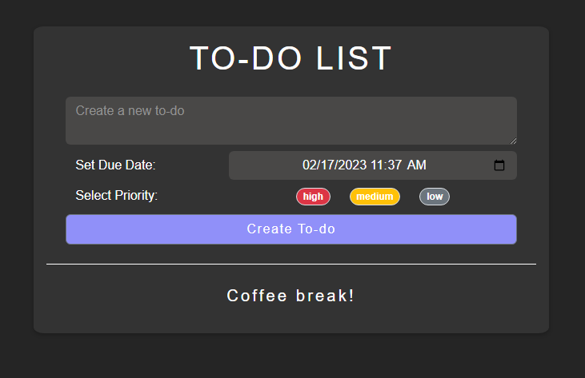
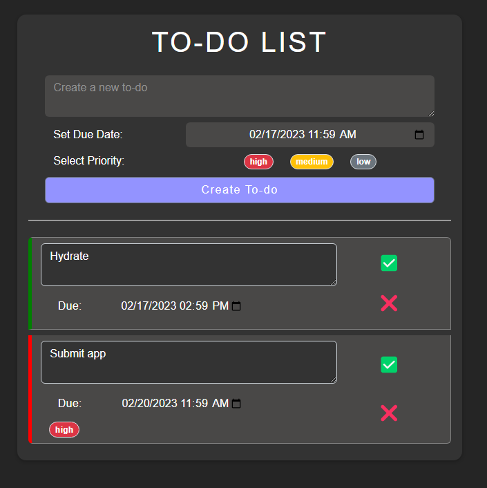

# React Takehome challenge

This project was bootstrapped with [Create React App](https://github.com/facebook/create-react-app).

## Available Scripts

In the project directory, you can run:

### `npm start`

Runs the app in the development mode.\
Open [http://localhost:3000](http://localhost:3000) to view it in your browser.

The page will reload when you make changes.\
You may also see any lint errors in the console.

# To-do List App

## Intro

This is a to-do list app made for an interview take-home challenge.

## Features

- Create a task
- Set a due date and time manually or via datepicker (timepicker does not work in Firefox)
- select high, medium, low priority for a task
- Todo list marks overdue items in real-time
- Todos can be marked done and restored
- Todos can be deleted
- Todos persist in localstorage
- Todos are color coded according to priority/overdue

