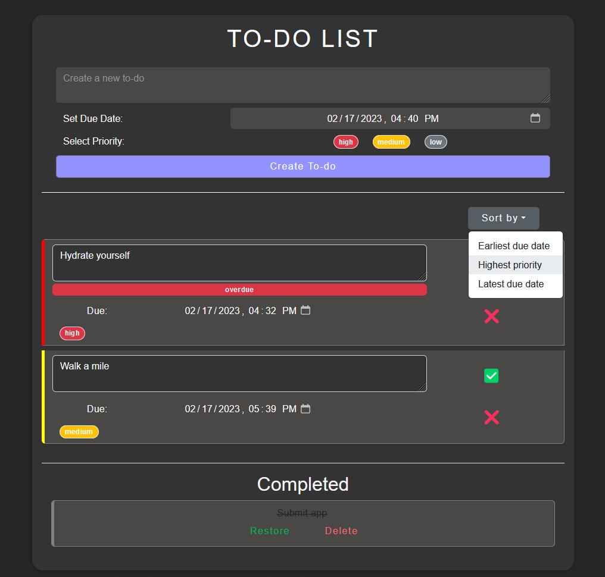

# React Takehome challenge

This project was bootstrapped with [Create React App](https://github.com/facebook/create-react-app).

## Available Scripts

In the project directory, you can run:

### `npm start`

Runs the app in the development mode.\
Open [http://localhost:3000](http://localhost:3000) to view it in your browser.

The page will reload when you make changes.\
You may also see any lint errors in the console.

# App Info

## Intro

This is a to-do list app made for an interview take-home challenge.

Features have been implemented without the addition of new npm modules so the app should be able to run on the original npm server environment. Consider reinstalling npm modules in a freshly cloned repo, otherwise.

- [Implemented Features](#implemented-features)
- [Future Features](#future-features-to-implement)
- [Dev Notes](#developer-notes)
- [Screenshots](#screenshots)

## Implemented Features
- Create a task
- Delete a task
- Set a due date and time manually or via datepicker (timepicker does not work in Firefox)
- Select high, medium, low priority for a todo
- Edit todo and duedate after creating the todo
- Todos can be marked done and restored
- Todo list marks overdue items in real-time
- Todos persist in localstorage
- Todos are color coded according to priority/overdue
- Sort by priority, earliest due dates, or latest due dates
- Show separate list of completed tasks marked done
- All-done message randomly chosen from set of messages and shown when there are no more tasks to complete

## Future features to implement
- Allow user to create custom tags.
- Allow user to create multiple lists.
- Allow user to edit priority after creating a task
- Filter/search for specific tasks (e.g. by keyword search, tag(s), date)
- Make sub-list (for breaking down todos into smaller tasks)
- Create overview page of multiple lists

## Developer Notes:
- Code may benefit from using Redux to keep state management cleaner and at top level of the app
- Break code down into more react components for more modularity
- Consider putting react component files into separate component folders with its local stylesheet

## Screenshots

